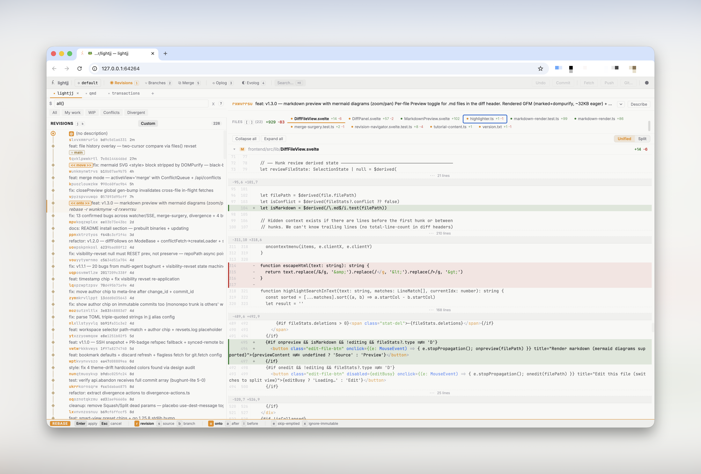

# lightjj

A fast, keyboard-driven browser UI for [Jujutsu (jj)](https://github.com/jj-vcs/jj), built for tight human–agent iteration loops. Single static binary — `go install` and open your repo.



## Why

**Speed.** Every interaction is tuned: commit-id-keyed caching means `j`/`k` through history is instant, diffs are syntax-highlighted progressively so the UI never blocks, and prefetch keeps the next revision warm. No spinners on the hot path.

**Agent-native review.** Drop per-line comments on a diff, export them to your agent, and when it iterates on the same revision the comments automatically re-anchor to the new commit — or get flagged as "possibly addressed" if the line was deleted. Feedback survives the rewrite.

**Keyboard-first, zero-ceremony UX.** `j`/`k` to navigate, `R` to rebase, `S` to squash, `n` for new, `Cmd+K` for everything else. No modals for common ops — rebase is inline: pick source, move cursor to destination, hit Enter.

## Quick Start

```bash
go install github.com/chronologos/lightjj/cmd/lightjj@latest
cd /path/to/your/jj/repo
lightjj
```

## Highlights

- **Revision graph** — SVG DAG, working-copy indicator, immutable markers, bookmark badges
- **Diff viewer** — unified/split modes, Lezer syntax highlighting, word-level diffs, context expansion, conflict A/B labels
- **Inline annotations** — per-line review comments keyed by `change_id`; auto-re-anchor when the agent rewrites; export as markdown or JSON
- **Inline rebase** — pick source mode (`-r`/`-s`/`-b`), target mode (onto/after/before), cursor to destination, Enter
- **Bookmarks & git** — set/move/advance/delete/track bookmarks, push/fetch with flag validation
- **Bookmarks panel** (`2`) — sync state at a glance: ahead/behind/diverged/conflict, commit descriptions + staleness, PR badges. Enter to jump, d/f/t to delete/forget/track
- **Multi-select** — batch abandon, squash, rebase across revisions
- **Op log & evolog** — full operation history and per-revision evolution with inter-diffs
- **Multi-repo tabs** — open additional repos in tabs (`+` button in the tab bar); diffs stay cached across tabs. Works over SSH too.
- **Workspaces** — detect and switch between jj workspaces; one-click opens as a tab (same origin, shared diff cache)
- **SSH remote** — proxy jj commands over SSH, or port-forward for local-quality performance
- **Themes** — Catppuccin dark/light (`t` to toggle)

## Agent review loop

1. Agent writes code into a jj revision
2. You review in lightjj — right-click any diff line → **Annotate** → pick severity, leave comment
3. `Cmd+K` → **Export annotations (markdown)** → paste into agent prompt
4. Agent iterates on the same `change_id` (jj's evolog captures every step)
5. lightjj auto-refreshes; annotations re-anchor via inter-diff delta — unchanged lines track, deleted lines surface as "possibly addressed"
6. Repeat until the revision is clean

See [docs/ANNOTATIONS.md](docs/ANNOTATIONS.md) for the re-anchor mechanics and storage model.

## Usage

```bash
lightjj                            # serve current repo, open browser
lightjj -R /path/to/repo           # explicit repo path
lightjj --remote user@host:/path   # SSH proxy mode
lightjj --no-browser               # don't auto-open browser
lightjj --addr localhost:8080      # custom listen address
```

### Remote repos

**Recommended:** run lightjj on the remote and port-forward — local-quality latency with full auto-refresh:

```bash
ssh -L 3001:localhost:3001 user@host \
  "lightjj -R /path/to/repo --addr localhost:3001 --no-browser"
# open http://localhost:3001 locally
```

`--remote user@host:/path` also works but adds ~400ms per command. Enable SSH ControlMaster to reduce this to ~20ms.

In `--remote` mode, `gh pr list` is also run over SSH — install and `gh auth login` on the remote host if you want PR badges on bookmarks.

## Requirements

- **jj >= 0.39**
- **Go >= 1.21** (build from source)
- **gh** (optional) — for PR badges. Must be installed and authed wherever the repo lives (remote host when using `--remote`)

## Development

```bash
# Two terminals:
go run ./cmd/lightjj --addr localhost:3000 --no-browser   # backend
cd frontend && pnpm run dev                                # frontend (Vite HMR)

# Tests
go test ./...              # Go
cd frontend && pnpm test   # Vitest
```

See [docs/ARCHITECTURE.md](docs/ARCHITECTURE.md) for system design.

## Upstream

Core command builder patterns ported from [jjui](https://github.com/idursun/jjui).
