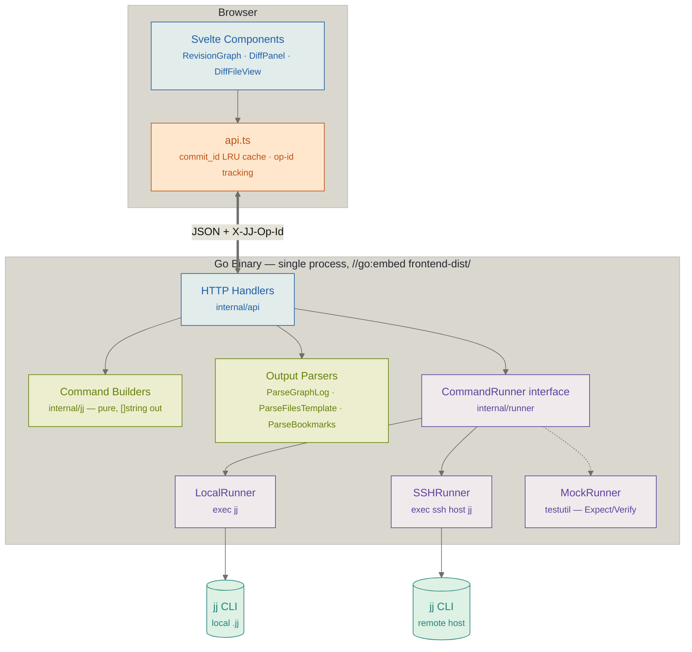
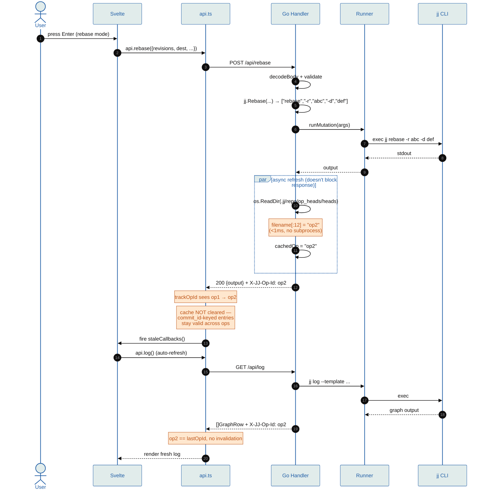
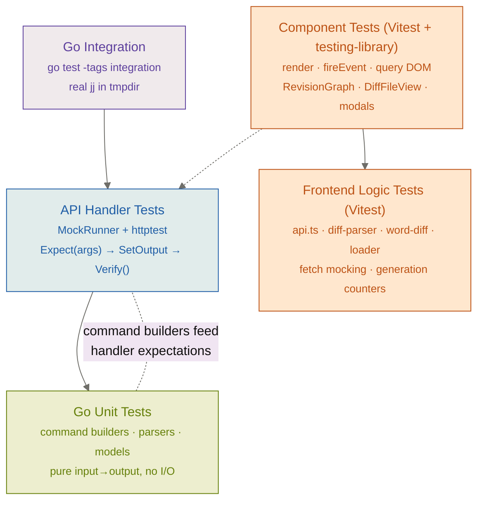
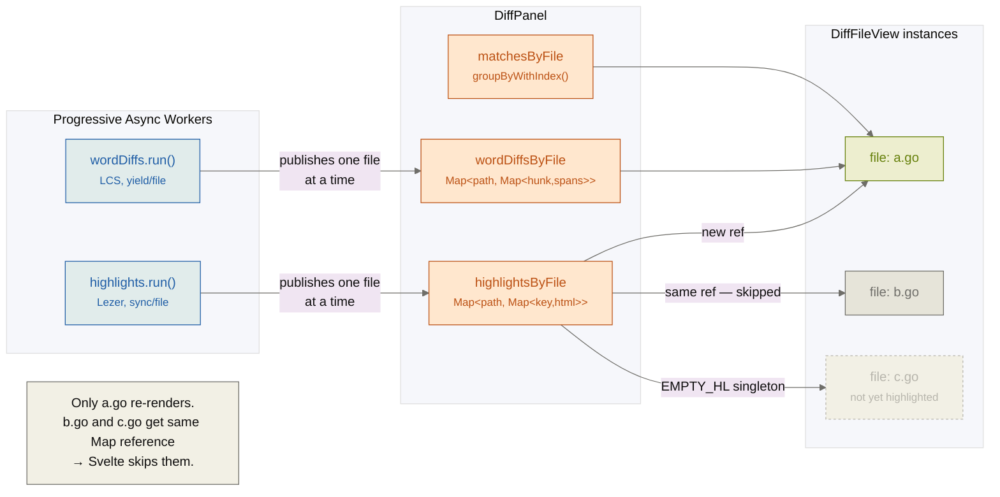
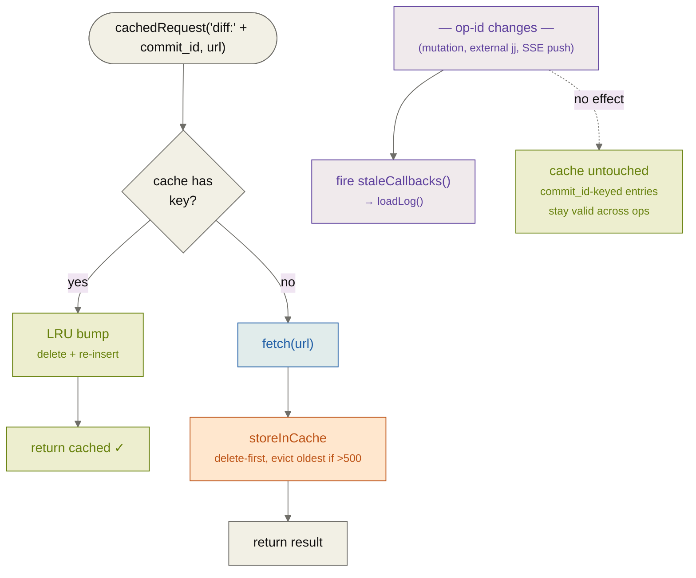

# Architecture

## Overview

lightjj is a browser-based UI for the Jujutsu (jj) version control system. It follows a two-process model: a Go backend that shells out to `jj` CLI, and a Svelte SPA frontend served as embedded static files.



**API endpoints:**

| Method | Path | Purpose |
|--------|------|---------|
| GET | `/api/log` | Graph log with revset + limit |
| GET | `/api/diff`, `/api/diff-range` | Unified diff (single revision or from/to range) |
| GET | `/api/files` | File list + stats + conflict status (single `FilesTemplate` subprocess — status char, exact +/- counts, conflict side-counts in one `jj log -T` call) |
| GET | `/api/bookmarks`, `/api/remotes`, `/api/description` | Metadata reads |
| GET | `/api/oplog`, `/api/evolog` | Operation/evolution history — structured `\x1F`-delimited template output. Evolog entries include predecessor commit IDs; the frontend shows per-step diffs via `/api/diff-range` (hidden evolution commits are addressable by `jj diff --from X --to Y`). |
| GET | `/api/file-show` | Raw file content at revision (for conflict viewing + inline editor) |
| GET | `/api/workspaces`, `/api/aliases`, `/api/pull-requests` | Environment info |
| POST | `/api/new`, `/api/edit`, `/api/abandon`, `/api/undo`, `/api/commit` | Basic mutations |
| POST | `/api/rebase`, `/api/squash`, `/api/split`, `/api/resolve` | Structured mutations |
| POST | `/api/describe` | Set description (uses `RunWithInput` for stdin) |
| POST | `/api/bookmark/{set,delete,move,advance,forget,track,untrack}` | Bookmark ops |
| POST | `/api/git/{push,fetch}` | Git remote ops (flag-whitelisted) |
| POST | `/api/alias` | Run a user-configured jj alias (validated against config) |
| POST | `/api/workspace/open` | Spawn child lightjj instance for another workspace |
| POST | `/api/file-write` | Write file directly to working copy (inline editor save). Local mode only — path validation rejects `..`, absolute paths, `.jj/`, `.git/`, null bytes, symlink escapes. |
| GET | `/tabs` | List open tabs (host-level, no `/tab/{id}/` prefix) |
| POST | `/tabs` | Open a repo in a new tab. Path validated with `jj workspace root` (400 if not a repo); canonical root deduped. Local mode only. |
| DELETE | `/tabs/{id}` | Close a tab (shuts down its watcher). Refuses the last tab. |

## Layer Responsibilities

### Command Builders (`internal/jj/`)

Pure functions with zero side effects. Each function takes parameters and returns a `[]string` of jj CLI arguments. No execution, no I/O.

```go
func Rebase(from SelectedRevisions, to string, ...) CommandArgs
// Returns: ["rebase", "-r", "abc", "-d", "def"]
```

Also contains data models and parsers:
- `Commit` — includes `ChangePrefix`/`CommitPrefix` for highlighted IDs, `Immutable` bool (from `◆` glyph), `Divergent` bool (from template `divergent` expression), `WorkingCopies []string` (for multi-workspace display)
- `Bookmark` — bookmark model + output parsers
- `FileChange` — file change model with `ConflictSides int`. `FilesTemplate`/`ParseFilesTemplate` combine `self.diff().stat().files()` (status char, destination path, exact `lines_added`/`lines_removed` integers) and `conflicted_files.map()` (path + `conflict_side_count`) in a single `jj log -T` call. Multi-revision revsets emit the template per-commit; the parser sums stats on duplicate paths and keeps the first-seen type (newest commit in jj's default order).
- `SelectedRevisions` — multi-revision selection helper
- `Workspace` — workspace model; `WorkspaceList` builder uses `WorkspaceRef.name()` + `.target()` template methods (no `": "` delimiter parsing)

**Template-based structured output** — When jj exposes a template method for the data you need, use it instead of parsing human-readable output. `FilesTemplate` replaced three separate subprocesses (`DiffSummary`, `DiffStat`, `ConflictedFiles`) plus a `\d+ \| \d+ [+-]*` regex and a `{src => dst}` brace-expansion resolver — the template gives you integers and destination paths directly, exits 0 on clean revisions, and tolerates arbitrary filenames. See `jj help -k templates` before adding text-based parsers.

### Command Runner (`internal/runner/`)

The single seam between HTTP handlers and subprocess execution:

```go
type CommandRunner interface {
    Run(ctx, args)            → ([]byte, error)       // jj subcommand
    RunWithInput(ctx, args, stdin) → ([]byte, error)   // jj subcommand + stdin
    Stream(ctx, args)         → (io.ReadCloser, error) // jj subcommand, streaming
    RunRaw(ctx, argv)         → ([]byte, error)       // non-jj binary (gh)
}
```

Two implementations:
- **LocalRunner** — executes `jj <args>` as a local subprocess with `Dir` set to the repo path. `RunRaw` execs `argv[0]` directly in the same dir.
- **SSHRunner** — wraps jj commands as `ssh <host> "jj -R <path> <args>"`, delegates to LocalRunner with `Binary: "ssh"`. `RunRaw` wraps as `ssh <host> "cd -- <path> && <argv>"` — `gh` has no `-R` equivalent, it infers the repo from cwd.

`RunRaw` exists so sidecar tooling runs **where the repo lives**. `gh pr list` on your laptop against an SSH-remote repo would look for a `.git` in the wrong place; routing it through the runner sends the command to the remote host with its `gh auth` state.

### API Layer (`internal/api/`)

Thin HTTP handlers. Each handler: parses request → calls command builder → executes via runner → returns JSON. No business logic — just plumbing.

**Multi-tab routing.** `TabManager` (`tabs.go`) owns the top-level mux; each tab is a complete `Server` mounted at `/tab/{id}/` via a pre-built `http.StripPrefix` handler. Opening a tab constructs a fresh `LocalRunner` + `Server` + `Watcher` for that repo. `Server` is unchanged — zero handler edits, it doesn't know tabs exist. Path validation runs `jj workspace root` (fails fast if not a repo, gives canonical path for dedup). The factory runs **outside** the write lock (construction opens fsnotify, ~20-50ms); double-check dedup under lock, shut down the orphan if a concurrent create won. Host-scoped routes — `/tabs`, `/api/config`, static files — live on `TabManager.Mux` directly. The `/api/` URL prefix is the frontend's per-tab discriminant: `tabScoped()` in `api.ts` prefixes `/api/*` with `/tab/{id}` and leaves `/tabs` unchanged. One constraint this imposes: **all `Server.routes()` paths must start with `/api/`** — anything else 404s in production (tests hit `srv.Mux` directly and won't catch it).

The server includes an operation ID cache (`cachedOp`) that tracks jj's current operation. Every JSON response includes an `X-JJ-Op-Id` header. Mutation endpoints refresh the cache asynchronously via `runMutation()`, which centralizes the post-mutation pattern (run command → refresh op ID → return output).

`refreshOpId()` reads `.jj/repo/op_heads/heads/` directly when `RepoDir` is set — the op-id IS the filename (128 hex chars, truncated to 12 for `short()`), and jj atomically swaps that file on every operation. `os.ReadDir` is <1ms vs ~15-20ms for a `jj op log` subprocess. Falls back to the subprocess for SSH mode (`RepoDir == ""`), divergent op heads (>1 file), or secondary workspaces where `.jj/repo` is a pointer file (ENOTDIR).

Handlers use `httptest.NewRecorder` + `testutil.MockRunner` for testing, so they never touch a real jj process in tests.

### Graph Parser (`internal/parser/`)

Parses `jj log` graph output (with `_PREFIX:` field markers and `\x1F` field delimiters) into `[]GraphRow` structs. Each row contains the graph gutter characters and parsed commit data. The parser detects node glyphs (`◆` immutable, `○` mutable, `@` working copy, `×` conflicted, `◌` hidden) and sets the corresponding flags on the `Commit` struct. The `divergent` boolean is parsed from the template's `divergent` expression and stored as a separate field (not as a `??` suffix on the change ID).

### Frontend (`frontend/`)

Svelte 5 SPA using runes (`$state`, `$derived`). Built with Vite, output goes to `cmd/lightjj/frontend-dist/`. In production, files are embedded in the Go binary via `//go:embed`. In development, Vite's dev server proxies `/api`, `/tab`, and `/tabs` to the Go backend.

`src/lib/api.ts` is a typed client that mirrors the Go API endpoints 1:1. It tracks the `X-JJ-Op-Id` header from responses and fires stale callbacks when the operation ID changes, triggering automatic cache invalidation and log refresh.

**Tab switching** is `{#key activeTabId}<App/>` in `AppShell.svelte` — a full remount. `setActiveTab()` sets the module-level `basePath` and clears per-repo memos (`_remotes`/`_aliases`/`_info`) + `lastOpId` before `activeTabId` changes, so the remounted App's top-level fetches hit the new prefix. The commit_id cache is **not** cleared: `commit_id` is a SHA-256 content hash (tree + parents + message), collision across repos is cryptographically negligible, so switching back to a tab serves cached diffs instantly. The highlight/word-diff `derivedCache` in `DiffPanel` is also commit_id-keyed and survives for the same reason.

## Data Flow

### Write path + state sync (e.g., rebase)

The full mutation → op-id detection → cache invalidation → auto-refresh cycle:



**Read path** is the lower half of this sequence without the preceding mutation. Key difference: the read path uses `cachedRequest()` which may return cached data immediately with zero subprocess spawns — see the commit_id cache section below.

### State synchronization

Every API response carries an `X-JJ-Op-Id` header with jj's current operation ID. The frontend tracks this value; when it changes (due to mutations from the UI, external CLI usage, or an SSE push from the fsnotify watcher), the API client fires stale callbacks that trigger a log refresh. **The per-revision cache is never cleared on op-id change** — it's keyed by commit_id, which is a content hash. If a commit_id still exists after the operation, its cached diff/files/description are provably still valid.

### Divergence resolution

Divergent commits (multiple commits sharing the same change ID) are detected via the `Divergent` field on the `Commit` struct. The frontend uses `effectiveId(commit)` — which falls back to `commit_id` for divergent/hidden commits — for all identity operations (DOM keys, checked sets, mutation API calls), since `change_id` is ambiguous for divergent commits.

```
User selects divergent commit → "Divergence" button appears in RevisionHeader
  → Click opens DivergencePanel (replaces DiffPanel)
  → Panel fetches api.log('change_id(X)') → all divergent versions
  → Fetches api.files(commitId) for each version in parallel → computes file union
  → Fetches api.log('parents(commitId)') for each version → shows parent info
  → User selects two versions to compare → api.diffRange(from, to, unionFiles)
  → Cross-version diff rendered with DiffFileView (reuses existing diff infrastructure)
  → "Keep" button abandons all other versions, resolves bookmark conflicts
```

The `diff-range` endpoint (`GET /api/diff-range?from=X&to=Y&files=a&files=b`) compares two arbitrary commits — including hidden commits from the evolog. File filtering uses repeated query params (not comma-separated) to handle paths with commas. Version cards are color-coded to match the diff: red for the "from" (deletions) side, green for the "to" (additions) side.

### Evolution log diffs

`jj evolog` tracks every working-copy snapshot as a hidden commit addressable by `jj diff`. The `Evolog()` builder uses `CommitEvolutionEntry` template methods (`.commit()`, `.operation()`, `.predecessors()`) to emit structured entries. `EvologPanel` renders these as a clickable list; clicking an entry calls `api.diffRange(predecessor_id, commit_id)` and renders the result through the existing `DiffFileView`. Zero new state tracking on either end — jj's object store is the state. `{#key selectedRevision?.commit.change_id}` in App.svelte remounts the panel on revision change to reset selection state.

**Limitation:** `diff --from pred --to cur` is only correct when parents didn't change between snapshots (the "agent editing WC" case). For rebase-heavy workflows, `CommitEvolutionEntry.inter_diff()` is rebase-safe (same as `jj evolog -p`) — not yet exposed.

### Inline rebase UX

Rebase does not use a modal. Instead, pressing `R` activates an inline rebase mode directly in the revision graph. The source commit is marked with a badge; `j`/`k` move a destination cursor through the graph (also badged); Enter fires the API call. Source mode (`-r`/`-s`/`-b`) and target mode (`-d`/`--insert-after`/`--insert-before`) are toggled with keyboard shortcuts while in rebase mode. Escape cancels without any API call.

### Conflict resolution UX

Conflicts are detected via the `conflicted_files` template (`Commit.conflicted_files()` + `TreeEntry.conflict_side_count()`) — structured output, no regex parsing, exits 0 on clean revisions. `FileChange.ConflictSides` carries the authoritative arity (2 = resolvable with `:ours`/`:theirs`, 3+ = N-way, buttons hidden).

**Letter-badge spatial correspondence** — commit descriptions are opaque to users ("Conflict resolution" doesn't describe the code). Instead of matching labels, the UI uses `[A]`/`[B]` badges on **both** buttons and section tabs: "Keep [A]" button visually corresponds to the "[A] commit-description" tab. Hover preview applies amber glow to the kept side and diagonal redaction stripes to the discarded side. No mental mapping required.

**Label semantics** — for `%%%%%%%` diff-style sides, the `\\\\\\\` "to:" sub-marker overwrites the `%%%%%%%` "from:" label. `:ours`/`:theirs` keeps the *result* (to-state), not the base (from-state), so the button label must name what you actually get. `conflict-parser.ts` handles this rewrite.

### Inline file editing

`FileEditor.svelte` wraps CodeMirror 6 in the split-view right column. Clicking Edit in unified view auto-switches to split (via `splitView = $bindable` write-back). Indent detection scans the first 200 indented lines to configure `indentUnit` (tabs vs N-spaces); `tabSize=4` matches `.diff-line { tab-size: 4 }` so columns align. Hunk folding collapses unchanged regions with 3 lines of context. `POST /api/file-write` writes directly to the filesystem — no jj command. The snapshot loop (`watcher.go`, 5s interval) picks up the write via `jj debug snapshot`, which advances op_heads → fsnotify fires → SSE pushes the new op-id → frontend reloads. Editing is gated on `diffTarget.kind === 'single'` — in multi-check mode the cursor position isn't what's being diffed, so `api.edit(cursor's changeId)` would target the wrong revision.

## Testing Strategy



| Layer | Count | Coverage |
|-------|-------|----------|
| Go unit | ~100 | Command builders, parsers (FilesTemplate, BookmarkList, GraphLog, WorkspaceList), models (`Commit.GetChangeId`, `SelectedRevisions`) |
| Go handlers | ~180 | Every endpoint's happy path + validation (400) + runner error (500) via `runnerErrorTest` helper |
| Go integration | ~30 | Build-tagged. CRUD journey, divergence resolution, diff-range file filtering, bookmark lifecycle |
| Frontend logic | ~150 | api.ts cache/op-id, diff-parser, word-diff LCS, split-view alignment, loader races, mode factories |
| Frontend component | ~150 | testing-library/svelte: render + fireEvent + DOM queries. Badge visibility, keyboard handlers, mode state, ARIA attrs |

**No E2E tests** — there's no Playwright/Cypress against a real backend. The closest is Go integration tests exercising the HTTP API directly, and component tests mounting individual Svelte components in jsdom.

The `testutil.MockRunner` uses an expect/verify pattern:

```go
runner := testutil.NewMockRunner(t)
runner.Expect(jj.Abandon(revs, false)).SetOutput([]byte("ok"))
defer runner.Verify()  // asserts all expectations called
```

## Key Design Decisions

1. **Shell out to jj, don't link it** — jj is written in Rust with no stable library API. Shelling out is what jjui does too, and it works well. The CommandRunner interface makes this testable.

2. **Structured output with graph parsing** — The backend uses `jj log` with a custom `--template` that outputs `\x1F`-delimited fields. The graph parser (`internal/parser/`) parses both the graph gutter characters and the structured field data from each line. This gives us the full DAG visualization from jj's own graph renderer, combined with structured commit data.

3. **Embed frontend in binary** — Single binary deployment via `//go:embed`. No Node runtime needed in production. Static files registered at `"/"` (all-methods subtree), **not** `"GET /"` — Go 1.22 ServeMux rejects patterns where neither is strictly more specific, and `"GET /"` is method-narrower but path-wider than `/tab/{id}/`.

4. **Two runner implementations, one interface** — Local and SSH execution are swappable at startup. The API layer doesn't know or care which is active.

5. **Multi-tab = N Servers, one process** — A tab is a full `Server` mounted at a URL prefix. No per-request `repoDir` parameter, no map-of-runners in handlers — `Server` is untouched, tests stay byte-identical. The `TabFactory` closure in `main.go` captures flag values so the startup repo and dynamically-opened repos get identical config; `makeServer()` unifies the two construction paths. Dispatch overhead is ~363ns/608B per request (dominated by `http.StripPrefix`'s shallow `*http.Request` clone) — noise next to a 15ms `jj` subprocess.

5. **`--tool :git` for diffs** — Users may have external diff tools configured (e.g., difftastic with `--color=always`). The web API forces jj's git-format diff output to get clean, parseable output.

6. **`--ignore-working-copy` on reads** — Without it, every `jj log`/`file show` re-stats every tracked file (~485ms in a large repo, measured). The snapshot loop (`watcher.go`) already runs `jj debug snapshot` every 5s, so read-path snapshots are redundant work that also contends on the WC lock — concurrent snapshotting commands serialize (measured 85% CPU for 5 parallel logs), while `--ignore-working-copy` commands parallelize freely (221% CPU). Worst case: an external file edit is visible ≤5s late before the SSE correction arrives — the same contract every other read already has.

7. **Immutable commit detection via graph glyphs** — The graph parser checks for `◆` vs `○` vs `@` when parsing node rows. `◆` sets `Immutable: true` on the `Commit` struct. The frontend uses this to dim immutable commits and color gutter symbols (`○` blue, `@` green) without needing a separate API call.

8. **Tracked view** — The revision panel supports a Log/Tracked toggle (`t` key). Tracked view issues a `jj log` request with the `tracked_remote_bookmarks()` revset, giving a focused view of remote branches without changing any global state.

9. **Op-ID staleness detection** — Every response carries `X-JJ-Op-Id`. The frontend detects operation changes and auto-refreshes. Mutation endpoints refresh the cached op-id asynchronously to avoid adding latency.

10. **Divergent commit identity** — Divergent commits share the same `change_id`, so the frontend uses `effectiveId()` (falls back to `commit_id`) for identity operations. The `change_id()` revset function (not `all:` which doesn't exist in jj 0.38) resolves all divergent versions. Divergence offsets (`/0`, `/1`) are computed client-side by lexicographic commit ID sort, matching jj's convention. The DivergencePanel is self-fetching — it receives only a `changeId` and manages its own data loading with separate generation counters for version fetching and diff fetching.

## Frontend Performance Patterns

**Per-file prop scoping** — `DiffPanel` passes per-file slices of global state to each `DiffFileView` rather than the full dataset. This localizes reactive invalidation:



- `highlightsByFile: Map<filePath, Map<key, html>>` — per-file inner Maps published as each file finishes. Already-done files keep their inner Map reference, so only the newly-highlighted `DiffFileView` re-renders. Stable `EMPTY_HL` singleton for not-yet-highlighted files.
- `wordDiffsByFile: Map<filePath, Map<hunkIdx, Map<lineIdx, spans>>>` — same progressive pattern. LCS computation yields between files; single-file context expansion only recomputes that file's entry. Stable `EMPTY_WD` singleton.
- `matchesByFile` — search matches pre-grouped by `filePath` via `groupByWithIndex()`, preserving global indices so `currentMatchIdx` comparison still works. Match-free files receive `EMPTY_MATCHES` (stable singleton), so their `lineMatchMap` `$derived` never reads `currentMatchIdx` → no dependency → no recompute on Enter/Shift+Enter.

**commit_id-keyed cache** — `api.ts` maintains a single 500-entry LRU Map keyed by `diff:<commit_id>` / `files:<commit_id>` / `desc:<commit_id>`. A commit_id is a content hash of tree + parents + message — if it hasn't changed, the cached data is provably valid. No op-id suffix, no clear-on-mutation, no concurrent-request staleness guard. `jj new` / `jj abandon` (leaf) / `jj undo` leave existing commit_ids unchanged → **zero** cache invalidation. Only rewrites (describe, rebase, squash) change commit_ids, and then only for the rewritten commit and its descendants — the rest stay warm. `clearAllCaches()` is reserved for explicit user-triggered hard refresh. See [CACHING.md](CACHING.md) for the full cache inventory and the invariants each depends on.



**Derived-computation cache** — `diff-cache.ts` holds `derivedCache` (30-entry LRU) mapping `activeRevisionId → {highlightsByFile, wordDiffsByFile}`. Without this cache, revisiting a commit re-runs Lezer + word-diff LCS even though the diff text is already cached in api.ts. App-lifetime scope survives DiffPanel unmount (DivergencePanel takes its slot via `{#if}`) and is reachable from hard-refresh via `clearDiffCaches()`. Highlight HTML uses `tok-*` CSS class names rather than inline styles, so the cache is theme-agnostic — theme toggle is a pure CSS var swap, no invalidation.

**`createLoader()` factory** — `loader.svelte.ts` encapsulates the generation-counter async pattern. Each `load()` supersedes any in-flight call; only the latest-started result is applied. The `loading` flag is deferred via `setTimeout(0)` so microtask-fast cache hits never flip it, preventing reactive-update cascades during cached j/k navigation. Exposes `.error` (cleared on successful load/set/reset) for inline error display. App.svelte declares 6 loaders instead of 6 hand-rolled load functions + 6 generation counters + 11 `$state` vars.

**`untrack()` for factory-internal `$state` reads** — when a factory's methods are called from inside a `$effect`, any `$state` read in the method's sync path becomes an effect dependency. `diff-derivation.svelte.ts` `update()` does `new Map(byFile)` to copy the current output; without `untrack()` the effect depends on its own output → `schedule_possible_effect_self_invalidation` → `effect_update_depth_exceeded` (visible since Svelte 5.44 batching change, PR #17145). `readByFile = () => untrack(() => byFile)` severs the link. Writes don't need untrack — the `untracking` flag doesn't affect `mark_reactions`. Memo writes use the local accumulator (`done`) not `byFile` — aliasing the live `$state` ref into an external cache risks an equality-check no-op on restore.

**Stale-while-revalidate** — `DiffPanel` shows the loading spinner only on **initial** load (`diffLoading && parsedDiff.length === 0`). For refreshes, the old content stays visible until the new diff arrives — the keyed `{#each parsedDiff as file (file.filePath)}` preserves `DiffFileView` instances across the swap, so scroll position survives. Previously the spinner branch unmounted everything → scroll jumped to top on every save.

**Mode objects over individual props** — `RevisionGraph` and `StatusBar` receive `{rebase, squash, split}` mode objects (from `modes.svelte.ts` factories with reactive getters) instead of 11+ individual props. Reactivity is preserved (Svelte tracks `.active`, `.sources`, etc. access); prop count drops 31→23 / 12→8.

**`mousemove`-driven hover over `:hover`** — `RevisionGraph` tracks `hoveredIndex` via a delegated `mousemove` handler (`closest('.graph-row')` → `dataset.entry`). `mousemove` fires only on physical pointer movement; `:hover`/`mouseenter` recompute on every paint and "slide" when layout shifts (error bar mount, `scrollIntoView`, post-rebase reshuffle) — phantom highlight under a stationary mouse while j/k moves `.selected` elsewhere. Building on `mousemove` makes this structurally impossible: no event fires during layout shift → state can't change. Side benefit: `hoveredIndex` shares `entryIndex` domain with `selectedIndex`, so all rows of a revision get `class:hovered` from one equality check — replaces 8 sibling-chain `:has()` CSS rules with one.

**`$derived` over `@const` for expensive template computations** — `toSplitView`, `computeSplitLineNumbers`, `computeLineNumbers` moved from `{@const}` (re-evaluates every render) to `$derived` (recomputes only when `file.hunks`/`splitView` change). This matters because `highlightedLines` updates trigger template re-renders without those dependencies changing.

**Bounded log fetch** — `GET /api/log` defaults to `--limit 500`, caps at 1000. Prevents unbounded payload/DOM on large repos.

**Serial mutations** — Concurrent jj mutations can produce divergent operation history (jj auto-reconciles, but avoidable). Multi-step flows (e.g., abandon N divergent versions → set N bookmarks) run serially. The perf cost is negligible for rare manual actions.

## Syntax Highlighting

Both read-only diffs and the inline editor use Lezer grammars. `highlighter.ts` calls `@lezer/highlight`'s `highlightCode()` with `classHighlighter`, which walks a parsed `Tree` and emits `tok-*` CSS class names (`tok-keyword`, `tok-string`, …). Parse + highlight for 500 lines runs in ~9ms, so there is no chunking or abort machinery — `highlightLines()` has a synchronous body.

**Theme-independent output.** `classHighlighter` emits class names, not inline styles. `theme.css` maps `tok-*` → `--syn-*` CSS vars, and each theme block (`:root` / `:root.light`) sets those vars. Theme toggle swaps the vars; cached HTML stays valid.

**Language coverage.** First-party `@lezer/*` grammars cover TS/JS, Go, Python, Rust, CSS, HTML, JSON, YAML. Bash and TOML wrap `@codemirror/legacy-modes` tokenizers via `StreamLanguage.define()` — the wrapper produces a Lezer `Parser` whose tree feeds `highlightCode` like any first-party grammar. Svelte has no Lezer grammar; `PARSERS['svelte']` maps to the HTML parser (tags/attrs/strings highlighted, `{interpolation}` and `<script>` bodies plain).

`FileEditor` (the inline CM6 editor) shares the same `@lezer/*` grammars via `@codemirror/lang-*`'s `LanguageSupport`, but renders through CM6's `syntaxHighlighting(defaultHighlightStyle)` (style-module CSS, not `tok-*`). Unifying onto `classHighlighter` would make `FileEditor` honor the same `tok-*` CSS — deferred; `defaultHighlightStyle` is good enough for an occasional inline edit.

## Graph View

The graph view uses jj's own graph output, parsed into DOM rows:

- Each graph line (node or connector) is its own DOM row at identical height
- Node lines show commit IDs + description on a second line
- Description lines get a continuation gutter (`│` extended from the node)
- Working copy `@` detected from graph characters, not template functions
- Connector lines are just gutter characters maintaining visual continuity

This approach gives pixel-perfect graph rendering by leveraging jj's graph layout algorithm directly, rather than reimplementing DAG layout in the frontend.
