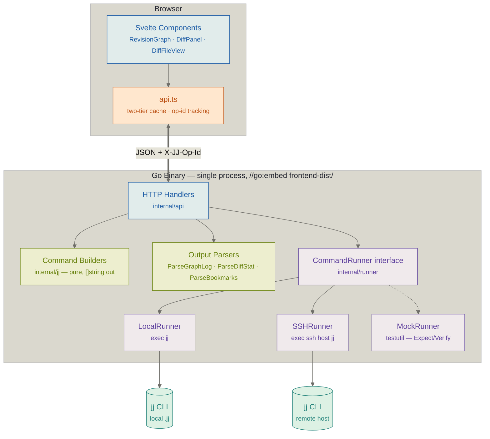
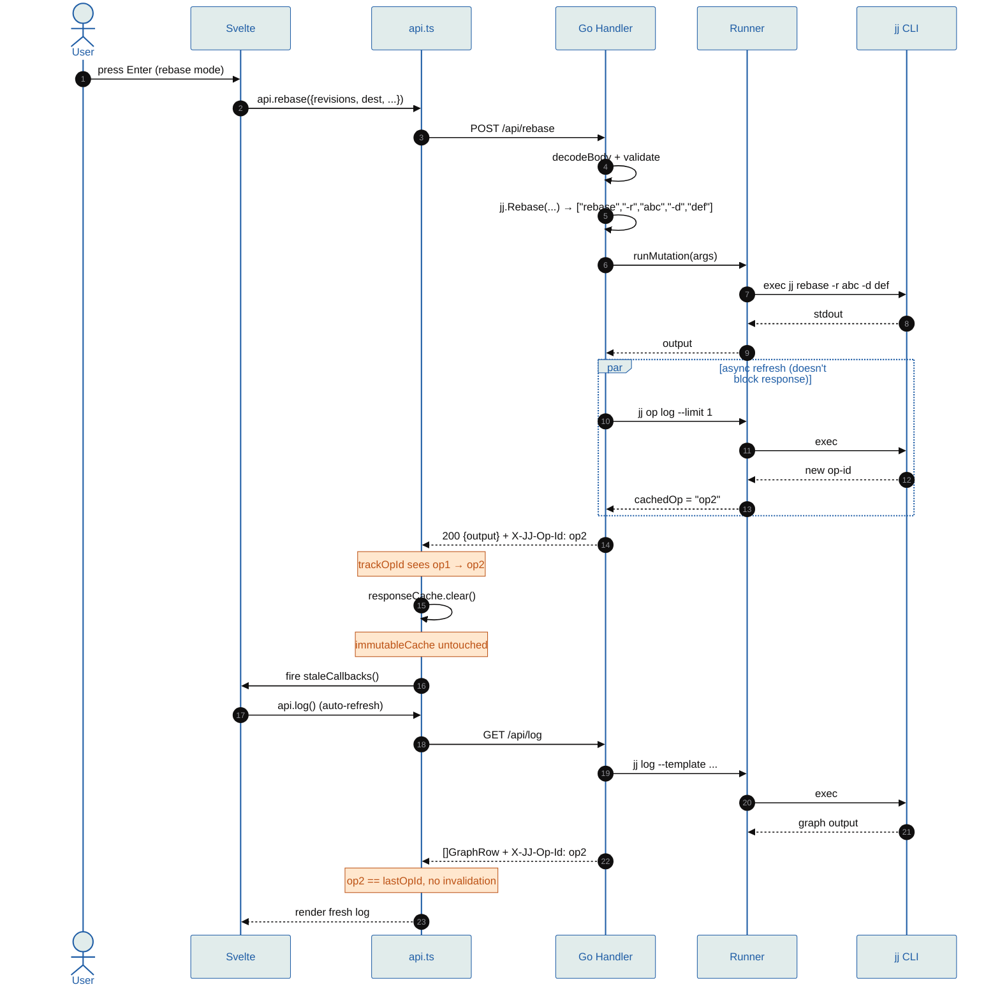
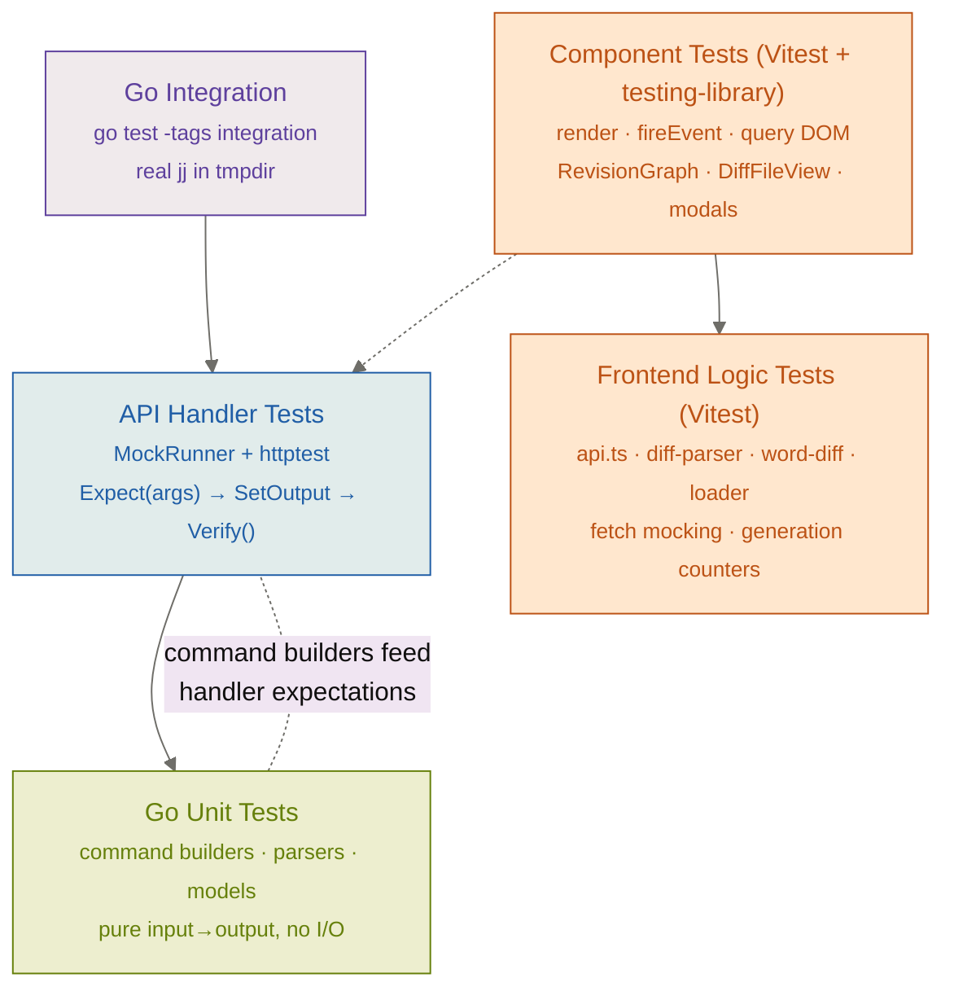
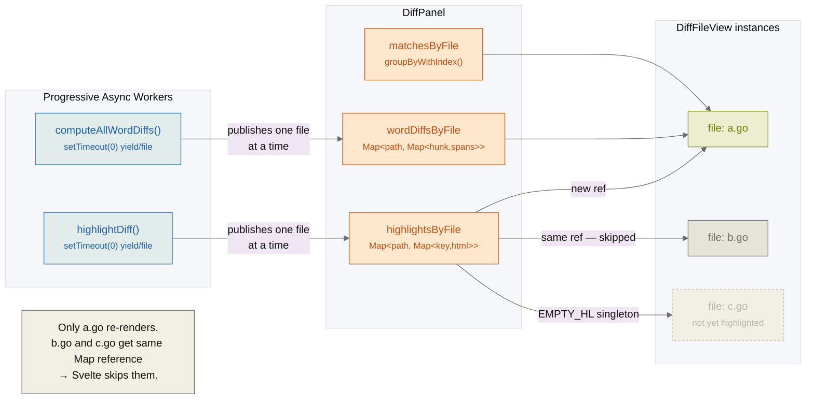
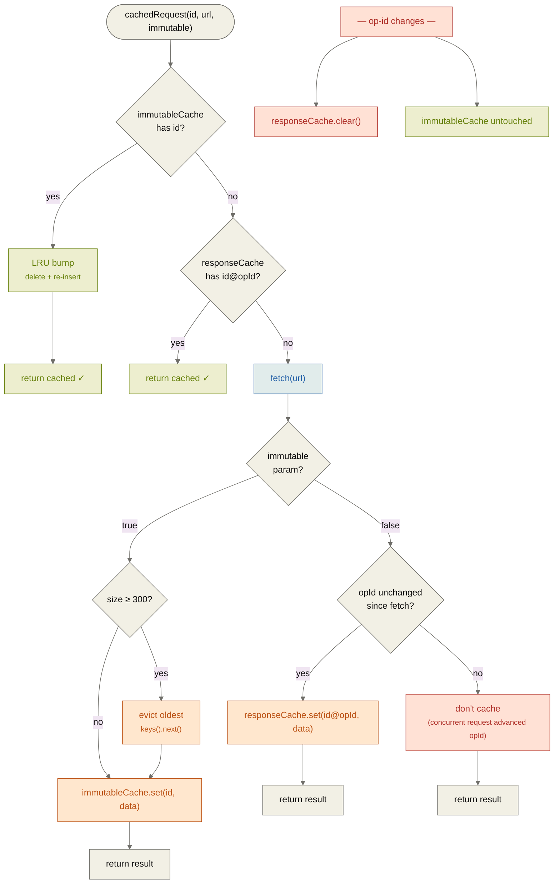

# Architecture

## Overview

lightjj is a browser-based UI for the Jujutsu (jj) version control system. It follows a two-process model: a Go backend that shells out to `jj` CLI, and a Svelte SPA frontend served as embedded static files.



**API endpoints:**

| Method | Path | Purpose |
|--------|------|---------|
| GET | `/api/log` | Graph log with revset + limit |
| GET | `/api/diff`, `/api/diff-range` | Unified diff (single revision or from/to range) |
| GET | `/api/files` | File list + stats + conflict status (3 parallel subprocess calls — DiffSummary, DiffStat, ConflictedFiles template) |
| GET | `/api/bookmarks`, `/api/remotes`, `/api/description` | Metadata reads |
| GET | `/api/oplog`, `/api/evolog` | Operation/evolution history |
| GET | `/api/file-show` | Raw file content at revision (for conflict viewing + inline editor) |
| GET | `/api/workspaces`, `/api/aliases`, `/api/pull-requests` | Environment info |
| POST | `/api/new`, `/api/edit`, `/api/abandon`, `/api/undo`, `/api/commit` | Basic mutations |
| POST | `/api/rebase`, `/api/squash`, `/api/split`, `/api/resolve` | Structured mutations |
| POST | `/api/describe` | Set description (uses `RunWithInput` for stdin) |
| POST | `/api/bookmark/{set,delete,move,forget,track,untrack}` | Bookmark ops |
| POST | `/api/git/{push,fetch}` | Git remote ops (flag-whitelisted) |
| POST | `/api/alias` | Run a user-configured jj alias (validated against config) |
| POST | `/api/workspace/open` | Spawn child lightjj instance for another workspace |
| POST | `/api/file-write` | Write file directly to working copy (inline editor save). Local mode only — path validation rejects `..`, absolute paths, `.jj/`, `.git/`, null bytes, symlink escapes. |

## Layer Responsibilities

### Command Builders (`internal/jj/`)

Pure functions with zero side effects. Each function takes parameters and returns a `[]string` of jj CLI arguments. No execution, no I/O.

```go
func Rebase(from SelectedRevisions, to string, ...) CommandArgs
// Returns: ["rebase", "-r", "abc", "-d", "def"]
```

Also contains data models and parsers:
- `Commit` — includes `ChangePrefix`/`CommitPrefix` for highlighted IDs, `Immutable` bool (from `◆` glyph), `Divergent` bool (from template `divergent` expression), `WorkingCopies []string` (for multi-workspace display)
- `Bookmark` — bookmark model + output parsers
- `FileChange` — file change model with `ConflictSides int`; `DiffStat`/`DiffSummary`/`ConflictedFiles` parsers; `expandRenamePath` (shared rename-brace resolver)
- `ConflictEntry` — conflict path + arity from template output
- `SelectedRevisions` — multi-revision selection helper
- `Workspace` — workspace model + parser

**Template-based structured output** — When jj exposes a template method for the data you need, use it instead of parsing human-readable output. `ConflictedFiles` uses `Commit.conflicted_files()` + `TreeEntry.conflict_side_count()` (jj ≥ 0.36) with `\x1F`-delimited fields — eliminates regex parsing, exit-code special-casing, and works correctly with multi-revision revsets (union). See `jj help -k templates` before adding text-based parsers.

### Command Runner (`internal/runner/`)

Interface with three methods:

```go
type CommandRunner interface {
    Run(ctx, args)            → ([]byte, error)       // synchronous
    RunWithInput(ctx, args, stdin) → ([]byte, error)   // with stdin
    Stream(ctx, args)         → (io.ReadCloser, error) // streaming
}
```

Two implementations:
- **LocalRunner** — executes `jj <args>` as a local subprocess with `Dir` set to the repo path
- **SSHRunner** — wraps jj commands as `ssh <host> "jj -R <path> <args>"`, delegates to LocalRunner with `Binary: "ssh"`

### API Layer (`internal/api/`)

Thin HTTP handlers. Each handler: parses request → calls command builder → executes via runner → returns JSON. No business logic — just plumbing.

The server includes an operation ID cache (`cachedOp`) that tracks jj's current operation. Every JSON response includes an `X-JJ-Op-Id` header. Mutation endpoints refresh the cache asynchronously via `runMutation()`, which centralizes the post-mutation pattern (run command → refresh op ID → return output).

Handlers use `httptest.NewRecorder` + `testutil.MockRunner` for testing, so they never touch a real jj process in tests.

### Graph Parser (`internal/parser/`)

Parses `jj log` graph output (with `_PREFIX:` field markers and `\x1F` field delimiters) into `[]GraphRow` structs. Each row contains the graph gutter characters and parsed commit data. The parser detects node glyphs (`◆` immutable, `○` mutable, `@` working copy, `×` conflicted, `◌` hidden) and sets the corresponding flags on the `Commit` struct. The `divergent` boolean is parsed from the template's `divergent` expression and stored as a separate field (not as a `??` suffix on the change ID).

### Frontend (`frontend/`)

Svelte 5 SPA using runes (`$state`, `$derived`). Built with Vite, output goes to `cmd/lightjj/frontend-dist/`. In production, files are embedded in the Go binary via `//go:embed`. In development, Vite's dev server proxies `/api` to the Go backend.

`src/lib/api.ts` is a typed client that mirrors the Go API endpoints 1:1. It tracks the `X-JJ-Op-Id` header from responses and fires stale callbacks when the operation ID changes, triggering automatic cache invalidation and log refresh.

## Data Flow

### Write path + state sync (e.g., rebase)

The full mutation → op-id detection → cache invalidation → auto-refresh cycle:



**Read path** is the lower half of this sequence (steps 17-23) without the preceding mutation. Key difference: the read path uses `cachedRequest()` which may return cached data immediately with zero subprocess spawns — see the two-tier cache section below.

### State synchronization

Every API response carries an `X-JJ-Op-Id` header with jj's current operation ID. The frontend tracks this value; when it changes (due to mutations from the UI or external CLI usage detected on next request), the API client clears its mutable response cache and fires stale callbacks that trigger a log refresh. Cached data for immutable commits lives in a separate cache that survives op-id changes — immutable commits' diffs/files/descriptions are stable by definition.

### Divergence resolution

Divergent commits (multiple commits sharing the same change ID) are detected via the `Divergent` field on the `Commit` struct. The frontend uses `effectiveId(commit)` — which falls back to `commit_id` for divergent/hidden commits — for all identity operations (DOM keys, checked sets, mutation API calls), since `change_id` is ambiguous for divergent commits.

```
User selects divergent commit → "Divergence ⚠" button appears in DiffPanel header
  → Click opens DivergencePanel (replaces DiffPanel)
  → Panel fetches api.log('change_id(X)') → all divergent versions
  → Fetches api.files(commitId) for each version in parallel → computes file union
  → Fetches api.log('parents(commitId)') for each version → shows parent info
  → User selects two versions to compare → api.diffRange(from, to, unionFiles)
  → Cross-version diff rendered with DiffFileView (reuses existing diff infrastructure)
  → "Keep" button abandons all other versions, resolves bookmark conflicts
```

The `diff-range` endpoint (`GET /api/diff-range?from=X&to=Y&files=a&files=b`) compares two arbitrary commits. File filtering uses repeated query params (not comma-separated) to handle paths with commas. Version cards are color-coded to match the diff: red for the "from" (deletions) side, green for the "to" (additions) side.

### Inline rebase UX

Rebase does not use a modal. Instead, pressing `R` activates an inline rebase mode directly in the revision graph. The source commit is marked with a badge; `j`/`k` move a destination cursor through the graph (also badged); Enter fires the API call. Source mode (`-r`/`-s`/`-b`) and target mode (`-d`/`--insert-after`/`--insert-before`) are toggled with keyboard shortcuts while in rebase mode. Escape cancels without any API call.

### Conflict resolution UX

Conflicts are detected via the `conflicted_files` template (`Commit.conflicted_files()` + `TreeEntry.conflict_side_count()`) — structured output, no regex parsing, exits 0 on clean revisions. `FileChange.ConflictSides` carries the authoritative arity (2 = resolvable with `:ours`/`:theirs`, 3+ = N-way, buttons hidden).

**Letter-badge spatial correspondence** — commit descriptions are opaque to users ("Conflict resolution" doesn't describe the code). Instead of matching labels, the UI uses `[A]`/`[B]` badges on **both** buttons and section tabs: "Keep [A]" button visually corresponds to the "[A] commit-description" tab. Hover preview applies amber glow to the kept side and diagonal redaction stripes to the discarded side. No mental mapping required.

**Label semantics** — for `%%%%%%%` diff-style sides, the `\\\\\\\` "to:" sub-marker overwrites the `%%%%%%%` "from:" label. `:ours`/`:theirs` keeps the *result* (to-state), not the base (from-state), so the button label must name what you actually get. `conflict-parser.ts` handles this rewrite.

### Inline file editing

`FileEditor.svelte` wraps CodeMirror 6 in the split-view right column. Clicking Edit in unified view auto-switches to split (via `splitView = $bindable` write-back). Indent detection scans the first 200 indented lines to configure `indentUnit` (tabs vs N-spaces); `tabSize=4` matches `.diff-line { tab-size: 4 }` so columns align. Hunk folding collapses unchanged regions with 3 lines of context. `POST /api/file-write` writes directly to the filesystem — no jj command, since jj auto-snapshots on the next API call that doesn't use `--ignore-working-copy`.

## Testing Strategy



| Layer | Count | Coverage |
|-------|-------|----------|
| Go unit | ~100 | Command builders, parsers (DiffStat, BookmarkList, GraphLog, WorkspaceList), models (`Commit.GetChangeId`, `SelectedRevisions`) |
| Go handlers | ~180 | Every endpoint's happy path + validation (400) + runner error (500) via `runnerErrorTest` helper |
| Go integration | ~30 | Build-tagged. CRUD journey, divergence resolution, diff-range file filtering, bookmark lifecycle |
| Frontend logic | ~150 | api.ts cache/op-id, diff-parser, word-diff LCS, split-view alignment, loader races, mode factories |
| Frontend component | ~150 | testing-library/svelte: render + fireEvent + DOM queries. Badge visibility, keyboard handlers, mode state, ARIA attrs |

**No E2E tests** — there's no Playwright/Cypress against a real backend. The closest is Go integration tests exercising the HTTP API directly, and component tests mounting individual Svelte components in jsdom.

The `testutil.MockRunner` uses an expect/verify pattern:

```go
runner := testutil.NewMockRunner(t)
runner.Expect(jj.Abandon(revs, false)).SetOutput([]byte("ok"))
defer runner.Verify()  // asserts all expectations called
```

## Key Design Decisions

1. **Shell out to jj, don't link it** — jj is written in Rust with no stable library API. Shelling out is what jjui does too, and it works well. The CommandRunner interface makes this testable.

2. **Structured output with graph parsing** — The backend uses `jj log` with a custom `--template` that outputs `\x1F`-delimited fields. The graph parser (`internal/parser/`) parses both the graph gutter characters and the structured field data from each line. This gives us the full DAG visualization from jj's own graph renderer, combined with structured commit data.

3. **Embed frontend in binary** — Single binary deployment via `//go:embed`. No Node runtime needed in production.

4. **Two runner implementations, one interface** — Local and SSH execution are swappable at startup. The API layer doesn't know or care which is active.

5. **`--tool :git` for diffs** — Users may have external diff tools configured (e.g., difftastic with `--color=always`). The web API forces jj's git-format diff output to get clean, parseable output.

6. **Immutable commit detection via graph glyphs** — The graph parser checks for `◆` vs `○` vs `@` when parsing node rows. `◆` sets `Immutable: true` on the `Commit` struct. The frontend uses this to dim immutable commits and color gutter symbols (`○` blue, `@` green) without needing a separate API call.

7. **Tracked view** — The revision panel supports a Log/Tracked toggle (`t` key). Tracked view issues a `jj log` request with the `tracked_remote_bookmarks()` revset, giving a focused view of remote branches without changing any global state.

8. **Op-ID staleness detection** — Every response carries `X-JJ-Op-Id`. The frontend detects operation changes and auto-refreshes. Mutation endpoints refresh the cached op-id asynchronously to avoid adding latency.

9. **Divergent commit identity** — Divergent commits share the same `change_id`, so the frontend uses `effectiveId()` (falls back to `commit_id`) for identity operations. The `change_id()` revset function (not `all:` which doesn't exist in jj 0.38) resolves all divergent versions. Divergence offsets (`/0`, `/1`) are computed client-side by lexicographic commit ID sort, matching jj's convention. The DivergencePanel is self-fetching — it receives only a `changeId` and manages its own data loading with separate generation counters for version fetching and diff fetching.

## Frontend Performance Patterns

**Per-file prop scoping** — `DiffPanel` passes per-file slices of global state to each `DiffFileView` rather than the full dataset. This localizes reactive invalidation:



- `highlightsByFile: Map<filePath, Map<key, html>>` — progressive Shiki highlighting publishes per-file inner Maps. Already-highlighted files keep their inner Map reference, so only the newly-highlighted `DiffFileView` re-renders on each publish. Stable `EMPTY_HL` singleton for not-yet-highlighted files.
- `wordDiffsByFile: Map<filePath, Map<hunkIdx, Map<lineIdx, spans>>>` — same progressive-async pattern as Shiki. LCS computation yields between files; single-file context expansion only recomputes that file's entry. Stable `EMPTY_WD` singleton.
- `matchesByFile` — search matches pre-grouped by `filePath` via `groupByWithIndex()`, preserving global indices so `currentMatchIdx` comparison still works. Match-free files receive `EMPTY_MATCHES` (stable singleton), so their `lineMatchMap` `$derived` never reads `currentMatchIdx` → no dependency → no recompute on Enter/Shift+Enter.

**Two-tier response cache** — `api.ts` maintains two Maps: `responseCache` (keyed by `${cacheId}@${opId}`, cleared on every op-id change) and `immutableCache` (keyed by bare `cacheId`, survives op-id changes, bounded at 300 entries with insertion-order LRU eviction). Immutable commits' diffs/files/descriptions can't change, so they're cached across operations. The separate cache avoids any re-keying logic on op-id changes — `trackOpId` just calls `responseCache.clear()`. Cache hits on the immutable tier bump the entry to the end of the Map (delete + re-insert), giving true LRU behaviour.



**`createLoader()` factory** — `loader.svelte.ts` encapsulates the generation-counter async pattern. Each `load()` supersedes any in-flight call; only the latest-started result is applied. The `loading` flag is deferred via `setTimeout(0)` so microtask-fast cache hits never flip it, preventing reactive-update cascades during cached j/k navigation. Exposes `.error` (cleared on successful load/set/reset) for inline error display. App.svelte declares 6 loaders instead of 6 hand-rolled load functions + 6 generation counters + 11 `$state` vars.

**Stale-while-revalidate** — `DiffPanel` shows the loading spinner only on **initial** load (`diffLoading && parsedDiff.length === 0`). For refreshes, the old content stays visible until the new diff arrives — the keyed `{#each parsedDiff as file (file.filePath)}` preserves `DiffFileView` instances across the swap, so scroll position survives. Previously the spinner branch unmounted everything → scroll jumped to top on every save.

**Mode objects over individual props** — `RevisionGraph` and `StatusBar` receive `{rebase, squash, split}` mode objects (from `modes.svelte.ts` factories with reactive getters) instead of 11+ individual props. Reactivity is preserved (Svelte tracks `.active`, `.sources`, etc. access); prop count drops 31→23 / 12→8.

**`$derived` over `@const` for expensive template computations** — `toSplitView`, `computeSplitLineNumbers`, `computeLineNumbers` moved from `{@const}` (re-evaluates every render) to `$derived` (recomputes only when `file.hunks`/`splitView` change). This matters because `highlightedLines` updates trigger template re-renders without those dependencies changing.

**Bounded log fetch** — `GET /api/log` defaults to `--limit 500`, caps at 1000. Prevents unbounded payload/DOM on large repos.

**Serial mutations** — Concurrent jj mutations can produce divergent operation history (jj auto-reconciles, but avoidable). Multi-step flows (e.g., abandon N divergent versions → set N bookmarks) run serially. The perf cost is negligible for rare manual actions.

## Syntax Highlighting: Dual Engine

The frontend ships two independent syntax highlighting engines — Shiki for read-only diffs and CodeMirror 6 for the inline editor. This is intentional technical debt worth consolidating later.

| | Shiki (read-only diffs) | CodeMirror 6 (inline editor) |
|---|---|---|
| **Purpose** | Highlight diff lines in `DiffFileView` | Interactive editing in `FileEditor` |
| **Rendering** | TextMate grammars → HTML strings via `{@html}` | Lezer incremental parser → CM6 decorations |
| **Languages** | 12 (TS, JS, Go, Python, Rust, CSS, HTML, Svelte, JSON, YAML, Bash, TOML) | 4 (TS/JS, Python, Go, Rust) |
| **Theme** | Catppuccin Mocha/Latte (TextMate theme JSON) | CSS variables matching catppuccin tokens |
| **Bundle cost** | ~1,074 KB source (~180 KB gzip): langs 713 + themes 102 + core 78 + vscode-textmate 98 + oniguruma-to-es 59 + oniguruma-parser 25 | ~1,254 KB source (shared with editor): view 469 + state 142 + language 99 + commands 82 + autocomplete 87* + 4 lang grammars |
| **Tree-shaking** | Yes — `shiki/core` + individual `shiki/langs/*.mjs` imports, JS regex engine (no WASM) | Yes — individual `@codemirror/*` imports. *`codemirror` meta-package pulls in unused `@codemirror/autocomplete` (~87 KB) — remove it. |

**Future consolidation:** CM6's `highlightCode()` API can produce static tokens without an editor instance, which could replace Shiki for diff highlighting. This would eliminate ~1,074 KB of source (~180 KB gzip) from the bundle at the cost of adding ~8 Lezer grammar packages (CSS, HTML, Svelte, JSON, YAML, Bash, TOML — all small) and rewriting `highlighter.ts` to produce CM6 token spans instead of Shiki HTML strings.

**Known bundle issue:** The `codemirror` meta-package in `package.json` is never directly imported — all imports use `@codemirror/*` individually. However, it pulls `@codemirror/autocomplete` (~87 KB) into the bundle as a side effect. Removing it from `dependencies` is a free ~25-30 KB gzip reduction.

## Graph View

The graph view uses jj's own graph output, parsed into DOM rows:

- Each graph line (node or connector) is its own DOM row at identical height
- Node lines show commit IDs + description on a second line
- Description lines get a continuation gutter (`│` extended from the node)
- Working copy `@` detected from graph characters, not template functions
- Connector lines are just gutter characters maintaining visual continuity

This approach gives pixel-perfect graph rendering by leveraging jj's graph layout algorithm directly, rather than reimplementing DAG layout in the frontend.
